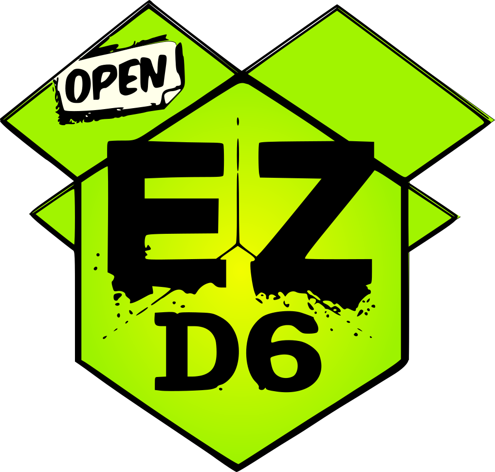

## Preface

If you are a player loooking to play with me, skip to the only section of interest to you: [House Rules](#house-rules). This post expects basic TTRPG literacy and familiarity with design tropes. Personal experience is preferable.

If you are looking at my game design skills, keep reading. This is not a review and I can't guarantee that everything I describe is by the book. [If you are so smart, go read it yourself.](https://www.ezd6.com/)

## What?

I have been playing TTRPGs as long as I remember myself, so designing my own system was a question of not *if* but *when*.

Having spent enough time in the shoes of D&D5e/Pathfinder 2 Warlocks, Barbarians and Sorcerers I decided to explore what else the world has to offer. My bane is that I often play with new players that have not explored the possibility space of role-playing game to any extent. Thus, fast onboarding is crucial.

EZD6 was love at first sight. The core advantages to me from *d20 roll-under + Vancian Magic + 50 years of cultural legacy* are as follows:

* **Small Hitpoints** Most things die fast and easy, including PCs (player characters). While 
* **No Leveling** Party is only as powerful as their items and profficiencies, the only way to enhance your characters is by doing what would be sensible. As far as I know, most tables rule with milestone[^what-is-milestone] leveling anyway, but this makes every upgrade althemore precious.
* **Tofu** Most things have little flavour, so they are easier to bend to suit another setting.
* **Universality** Roll `Nd6`, take highest or lowest, done. Most things are resolved like that. The only types of boosts one gain from their party members is rolling more dice, thereby increasing th chances of rolling a higher number.
* **Rule Synergy** Since there are so few rules all of them feed into eachother, discussed further in [MDA Analysis](#mda-analysis). 
* **No "Gaming The System"** The system is very small and relies heavily on player-to-dm trust. I think that said trust should de facto be on the table in any game, but the light weight ensures munchkins and minmaxers don't win over by a technicality.
* **No Mental Maths** I like maths problems and puzzles. I hate mental maths. Haven't met a single person that enjoys it, all the less the chance that they'll play in my game.

On the other hand, the system has it's an issue for some player groups.

* **No Numbers** Spells don't have levels, items don't have weight, attacks don't call for damage dice. It's not for detailed and intricate strategic combat.

## Why are light rules important?

They prevent designing around it. One prime example for me are unbalanced encounters, often resulting in an *unexpected TPK (total party kill)*. Here, *unexpected* meaning not arising from the world the game is set in and players' underestimating a monster's power, but from the DM failing to estimate the danger within the system. *Not within the game world, within the system.*

This comes with a presupposition the DM is supposed to juggle the system's parameters in just the right way to not destroy all players at once. Balancing shifts from an issue of tailoring the game for the players, to marrying your critical path to the game's frame. This is the process I want to avoid. 

The allure of rules can be charming. I like putting on my *system designer's* hat. One reason for me to put it on is the electrically synergistic design of *karma*, *rolls* and *boons*. 

## MDA Analysis

MDA[^mda] stands for Mechanics-Dynamics-Aesthetics, a framework used for analyzing games in terms of how mechanics encourage players to act in a certain way to manifest an emotion.

Mechanically, the game has 3 constituents: checks, attacks and casts. 

### Checks

The *checks* require the player to roll a D6. They roll an extra one for each boon and pick the highest or add extra dice for each bane and pick the lowest. The DM assigns a *difficulty* to each check, a number from 1 to 6. If the value of the roll meets or beats the *difficulty*, the check is *passed* and *failed* otherwise. A 6 always succeeds, a 1 always fails.

Adding a rule for these values specifically is a decision. If the difficulty is 6, the check is passed vacously. If the difficulty is 1, there is no point in rolling a check, since every value would pass. Having an automatic pass and fail draws special attention to a very good or a very bad roll[^nat-20].

### Boons & Banes

The difficulty and degree of success is further mediated by *boons* and *banes*. They can come from the character's special abilities or are gived by the DM. Each boon adds one more dice and lets you pick the highest. Each bane adds one more dice and forces you to pick the lowest. Boons and banes cancel out.

Giving players a permanent *boon* to a specific kind check via a special item is a great way to control progression and instill a sense of achievement. A fitting *bane* from poor visibility or overpowering internal termoil can deepen the immersion by limiting something a player would usually be good at.

The players can also help eachother. If you are proficient in something, you may incur a boon on someone else's roll. A scribe might help a warrior decypher a scroll. The ability to gift a bonus to another player *for free* encourages cooperations at basically no cost.

This also fixes a problem of overspecialising. In a standard RPG party each character does only what they are good at. A party member doing it with help is not much different to doing it yourself.

This allows each player to feel powerful in their own vein and not underpower in someone else's specialization. Having a thief party member is still beneficial, but they can help everyone pick locks anyway. The feeling of lending a hand is good for both players and builds good bonds if roleplayed well.

### Karma

Karma is the system currency given for failing a roll or dished out as a bonus from the DM. It allows players to boost the value of any roll (except a 1) any amount of times.

Each time a *check* is failed the failer gets one *karma*. Karma points allow players with bad roll streaks to come back. Getting bad dice rolls in other systems can be viewed as punishment for playing the game as intended. Compensatory mechanics like this give players some control over the inherent output[^output-randomness] randomness.

This gives players courage they need to start acting. Failing a roll in the moment means that some time later you can secure that all-important gut-whirling check.

### Hero Dice

Alternatively, if a player rolls a on ethey may use their Hero Dice. They dice can be used to reroll *any* failure. 5 karma can be converted into a hero dice at any moment[^karma-6], but there can supposedly be only one at a time[^one-hero-dice].

## House Rules

At my table we added a couple of mechanics atop the main game. Since the base system is so barebones, bringing our favourite rules from other systems seemed like an obvious choice.

### Blaze Of Glory

Named after a similar rule in [Daggerheart](https://daggerheart.org/rules).

Upon death, a character may wish to do a final action, they are granted a maximum degree of success. If the action is casting a spell, they may cast any spell with the power level equal to their `karma + 1`.

The death of a character is a very dangerous event to the story, especially in plotless genres like TTRPG. It is an important to everyone at the table, so it only makes sense to shift focus to it as the highlight.

### Fussy Focus

Taken from this [youtube video](https://youtu.be/bZheDgXE5F0?si=SQn_aUCAbRTxHxZJ).

A caster can only cast spells when specific requirements are met. The environment has to contain some specific features, such as the ones listed below. The more prominent, the stronger the spell can be cast.

* **Shadow Focus** Old shadow, the older - the better. Fresh one-hour shadow for a weak spell, a century old mountain's cover for a strong one.

* **Lit Focus** Direct light. A meager candle can be enough for a small cantrip, but a bonfire or heavenly rays required for strong casting.

* **Death Focus** Corpses, meat and bones. The more deathly the place, the better, works amazingly well for graveyards. *Although it can seem applicable best to necromancers, I assure you that's not what you want. If they find a single graveyard, the game is doomed.*

* **Fire Focus** Be in or on fire. The more fire, the merrier.

You may decide to take one of the focuses from above or negotiate a custom one with me.

Notice, that they don't guarantee a successful cast, they only *allow* an opportunity. A shadow focus wizard casting a resurrection spell in the middle of an open daylit field is not possible.

### Daggerheart's Turn Dynamic

Players go in whatever order they choose. Unless surprised, the players always go first. Players keep doing actions on their turn until they fail a roll. For every roll the master is given an "action token". When an action fails, the turn goes to the DM, that can do as many "actions" as they have "tokens". When the DM runs out of action tokens, the turn goes back to the players.

This keeps the flow of the game smooth and naturally restrics longer turns, while also giving the players an option to keep their streak going at the cost of karma and hero dice. *Remember, 1 can only be recovered from for 5 karma!*

### Spellcasting Boons or Banes

Some items reduce the amount of dice a spellcaster has to roll to a minimum of one. This allows caster to recieve magic items that are not terribly overpowered while remaining effective. If rolling with banes, just roll more dice.

I once ruled that a boon allowed the caster to reroll a one, that was completely off-balance. If you know, you know. 

### Cold Shot

This rule was retold to me many times for D&D, but my version is suited for EZD6.

A player may try and attack a specific part of a creature. They may only do that if the boons on the roll outweigh the banes. When doing this attack you get +2 bane. A successful attack deals double damage or invokes a specific effect otherwise.

### Focus Tracking

Coming from Wildsea Free Edition p119. Not as much a rule, as much a DM trick.

Since the turn order between players is flexible it is important to give everyone a chance to shine. Have a small list with each player's name and write down a tick for every action they did. This serves as a clear visual indication to how often players act. If one player is not acting nearly as much as everyone else, hit them up with something unexpected.

### Intended failure

You may choose to fail a roll, vocally or privately.

### When To Roll

I only allow rolls when there is a clear goal in mind. 

This is sometimes an issue in, for instance, D&D. When a player decides to roll 'Insight' or 'Athletics' or anything. Sure, with insight you can be sure they are trying to detect deception, but any other roll should have a goal in mind.

Also, please don't roll unless you are asked to. That's just rude.

## Licensing & Usage

EZD6 is distributed under the Open Game License. The restated rules from other places are distributed under their respective licenses.

[^mda]: ["Formal Approach to Game Design and Game Research"](https://users.cs.northwestern.edu/~hunicke/MDA.pdf) by Robin Hunicke, Marc LeBlanc, Robert Zubek
[^output-randomness]: ["3 Minute Game Design: Episode 6 - Output Randomness"](https://www.youtube.com/watch?v=2qfFEP_-LkI) by Keith Burgun Games
[^one-hero-dice]: ...*technically*, you can have more. There is rarely a need to be able to carry more than one at a time, so this is not as much a limitation, as much as just an edgecase that doesn't happen. There is not insentive for players to hoard them.
[^milestone]: Party levels up whenever the master says they level up. As opposed to leveling based on experience points. Usually preferred, since allows a finer control over character growth.
[^nat-20]: Natural twenties in D&D are very rewarding. Even though by the 5E book the automatic success always happens on an attack roll, basically every DM out there rules them as a universal success.
[^karma-6]: At my table we agreed that one *hero dice* costs 6 karma. This is done solely to ease tallying. I didn't have any small tokens at home, so we counted it using spare d6s.
