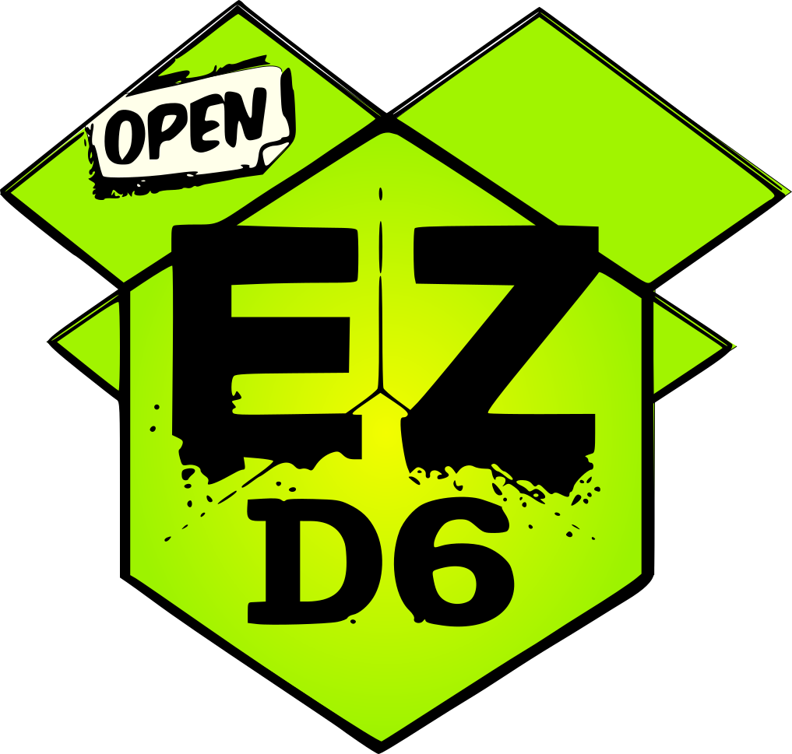

## Preface

If you are a player loooking to play with me, skip to the only section of interest to you: [House Rules](#house-rules).

If you are looking at my game design skills, keep reading.

## What?

I have been playing TTRPGs as long as I remember myself, so designing my own system was a question of not *if* but *when*.

Having spent enough time in the shoes of DnD5e/Pathfinder 2 Warlocks, Barbarians and Sorcerers I decided to explore what else the world has to offer. My bane is that I often play with new players that have not explored the possibility space of role-playing game to any extent. Thus, fast onboarding is crucial.

EZD6 was love at first sight. The core advantages to me from *d20 roll-under + Vancian Magic + 50 years of cultural legacy* are as follows:

* **Small Hitpoints** Most things die fast and easy, including PCs (player characters). While 
* **No Leveling** Party is only as powerful as their items and profficiencies, the only way to enhance your characters is by doing what would be sensible. As far as I know, most tables rule with milestone[^what-is-milestone] leveling anyway, but this makes every upgrade althemore precious.
* **Tofu** Most things have little flavour, so they are easier to bend to suit another setting.
* **Universality** Roll `Nd6`, take highest or lowest, done. Most things are resolved like that. The only types of boosts one gain from their party members is rolling more dice, thereby increasing th chances of rolling a higher number.
* **Rule Synergy** Since there are so few rules all of them feed into eachother, discussed further in [MDA Analysis](#mda-analysis). 
* **No "Gaming The System"** The system is very small and relies heavily on player-to-dm trust. I think that said trust should de facto be on the table in any game, but the light weight ensures munchkins and minmaxers don't win over by a technicality.
* **No Mental Maths** I like maths problems and puzzles. I hate mental maths. Haven't met a single person that enjoys it, all the less the chance that they'll play in my game.

On the other hand, the system has it's issues for some player groups.

* **No Numbers** Spells don't have levels, items don't have weight, attacks don't call for damage dice. It's not for detailed and intricate strategic combat.

## MDA Analysis

MDA[^mda] stands for Mechanics-Dynamics-Aesthetics, a framework used for analyzing games in terms of how mechanics encourage players to act in a certain way to manifest an emotion.

Mechanically, the game has 3 constituents: checks, attacks and casts. 

The **checks** require the player to roll a d6. They roll an extra one for each boon and pick the highest or add extra dice for each bane and pick the lowest. A 6 always succeeds, a 1 always fails.

Usually, the boons and banes are distributed by the DM, hence the players don't really have control over this. However, the players can help eachother out by incuring a boon on someone else's roll if they have the skills. A scribe might help a warrior decypher a scroll. The ability to gift a bonus to another player *for free* intensifies cooperations and allows playres to collaborate better.

Players can alter the result of their rolls by getting contributing their karma. Karma can be used to boost any roll but a one. What's more interesting, is that players get karma by **failing rolls**. When a roll is failed, the character gets 1 karma point. This balancing mechanic is to me the most brilliant part of the design.

Karma points allow players with bad roll streaks to come back. Getting bad dice rolls can be viewed as punishment for playing the games. Compensatory mechanics like this give players some control over the inherent output[^output-randomness] randomness.

Alternatively, if a player rolls a on ethey may use their Hero Dice. They dice can be used to reroll *any* failure. 5 karma can be converted into a hero dice at any moment, but there can supposedly be only one at a time[^one-hero-dice]. 

## Machinations Analysis

Machinations is a framework that focuses on describing a game as a combinations of feed-back loop and resource conversion processes.

However, the only process governed by rules that can be viewed as a resource transaction is raw combat, so this chapter will focus on the out-of-the-box combat mechanics.

The formal resources by rules of EZD6 are *Karma*, *Hero Die*, *Hitpoints* of the PCs and the Bag Guys, *Boons*/*Banes*. This yields interesting relationships.

## House Rules 

### Blaze Of Glory

Named after a similar rule in [Daggerheart](https://daggerheart.org/rules).

Upon death, a character may wish to do a final action, they are granted a maximum degree of success. If the action is casting a spell, they may cast any spell with the power level equal to their `karma + 1`.

### Fussy Focus

Taken from this [youtube video](https://youtu.be/bZheDgXE5F0?si=SQn_aUCAbRTxHxZJ).

A caster can only cast spells when specific requirements are met. The environment has to contain some specific features, such as the ones listed below. The more prominent, the stronger the spell can be cast.

* **Shadow Focus** Old shadow, the older - the better. Fresh one-hour shadow for a weak spell, a century old mountain's cover for a strong one.

* **Lit Focus** Direct light. A meager candle can be enough for a small cantrip, but a bonfire or heavenly rays required for strong casting.

* **Death Focus** Corpses, meat and bones. The more deathly the place, the better, works amazingly well for graveyards. *Although it can seem applicable best to necromancers, I assure you that's not what you want. If they find a single graveyard, the game is doomed.*

* **Fire Focus** Be in or on fire. The more fire, the merrier.

You may decide to take one of the focuses from above or negotiate a custom one with me.

Notice, that they don't guarantee a successful cast, they only *allow* an opportunity. A shadow focus wizard casting a resurrection spell in the middle of an open daylit field is not possible.

### Daggerheart's Turn Dynamic

Players go in whatever order they choose. Unless surprised, the players always go first. Players keep doing actions on their turn until they fail a roll. For every roll the master is given an "action token". When an action fails, the turn goes to the DM, that can do as many "actions" as they have "tokens". When the DM runs out of action tokens, the turn goes back to the players.

This keeps the flow of the game smooth and naturally restrics longer turns, while also giving the players an option to keep their streak going at the cost of karma and hero dice. *Remember, 1 can only be recovered from for 5 karma!*

### Spellcasting Boons or Banes

Some items reduce the amount of dice a spellcaster has to roll to a minimum of one. This allows caster to recieve magic items that are not terribly overpowered while remaining effective. If rolling with bains, just roll more dice.

I once ruled that a boon allowed the caster to reroll a one, that was completely off-balance. If you know, you know. 

## Licensing & Usage

EZD6 is distributed under the Open Game License. The restated rules from other places are distributed under their respective licenses.

[^mda]: ["Formal Approach to Game Design and Game Research"](https://users.cs.northwestern.edu/~hunicke/MDA.pdf) by Robin Hunicke, Marc LeBlanc, Robert Zubek
[^output-randomness]: ["3 Minute Game Design: Episode 6 - Output Randomness"](https://www.youtube.com/watch?v=2qfFEP_-LkI) by Keith Burgun Games
[^one-hero-dice]: ...*technically*, you can have more. There is rarely a need to be able to carry more than one at a time, so this is not as much a limitation, as much as just an edgecase that doesn't happen. There is not insentive for players to hoard them.
[^milestone]: Party levels up whenever the master says they level up. As opposed to leveling based on experience points. Usually preferred, since allows a finer control over character growth.
