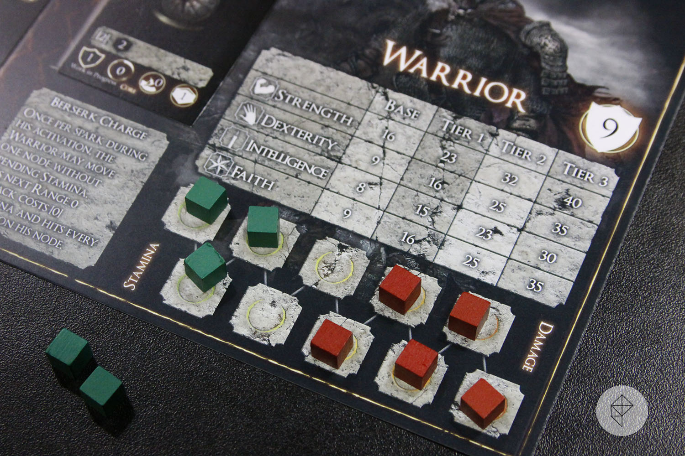

## Introduction 

### General Context

A healthbar is a staple of modern gaming: a visible red bar of how close you are to failure. In contrast to other resources, depleted health means certain (usually also immediate) failure. It is basically a dual of the point system.

The bar consists of 2 values: the *maximum* and the *current*. The *current* value is capped by the maximum and is reduced by external influences, like enemies or healing potions. Once the current reaches 0 the player is dead and the game starts over. The *maximum* grows on milestones, like reaching a new level or getting better armor.

There is a lot of variety regarding it, the most common version by far being the separation between *discrete* and *continous*. Technically, both are using whole numbers so both *can* be called discrete, but the differences go beyond just numbers.

Discrete healthbars usually consist of *hearts*. For pragmatism the amount of hearts is kept low, same for the damage. The players will have difficulty assessing how alive their character is if they have to tally up the red dots every time. Systems like this make health feel more valuable and health loss more significant.

It is very accessible and extensible: roguelike commonly introduce different types of hearts: Demon Hearts in the Binding of Isaac and Shields in Enter the Gungeon both represent a temporary extension of your health.

### And another one!

## Examples

## Blades in the Dark

## Moonring

In Moonring you have a shield, it recovers. Your health does not.

## Dark Souls: The Boardgame

*The stamina tokens (green) and the health tokens (red). Taken from [Polygon's report on the game](http://web.archive.org/web/20250522040913/https://www.polygon.com/2016/8/8/12404378/dark-souls-board-game-preview-gencon-2016).*

## Reigns

In reigns you are a ruler managing 4 areas of your kingdom:
